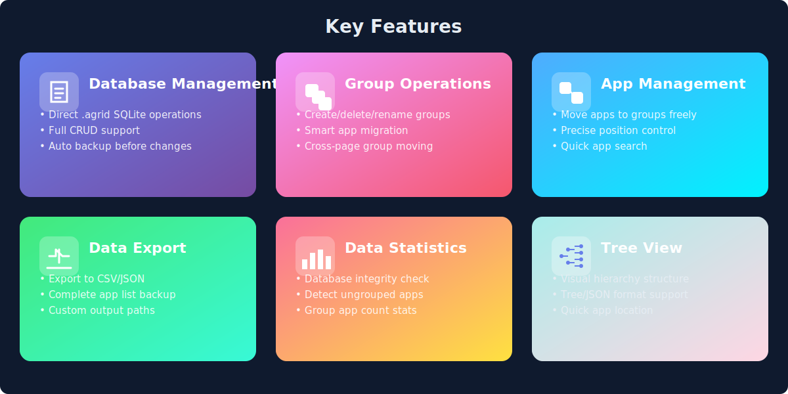
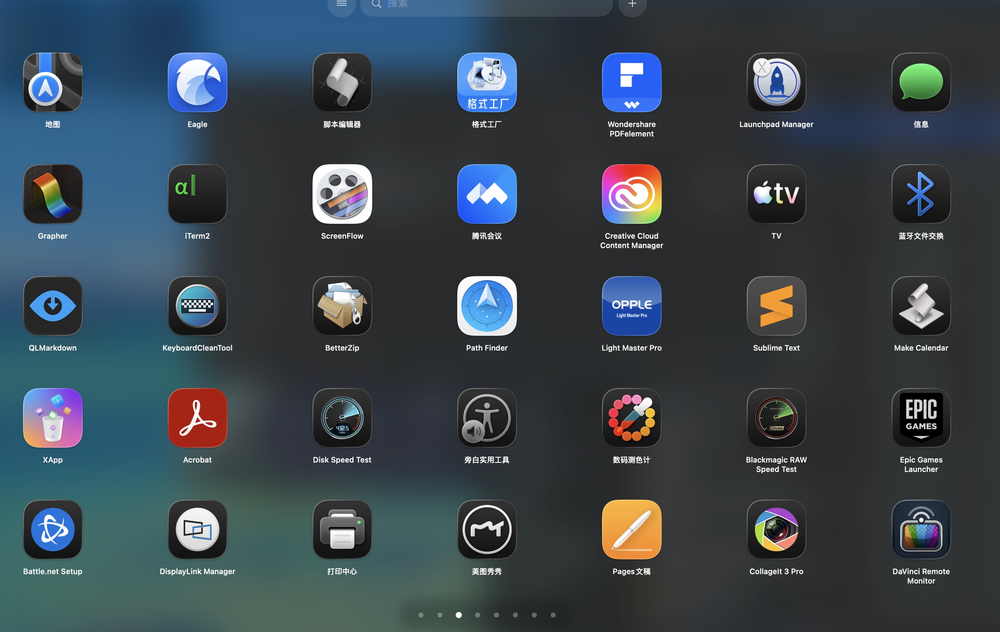
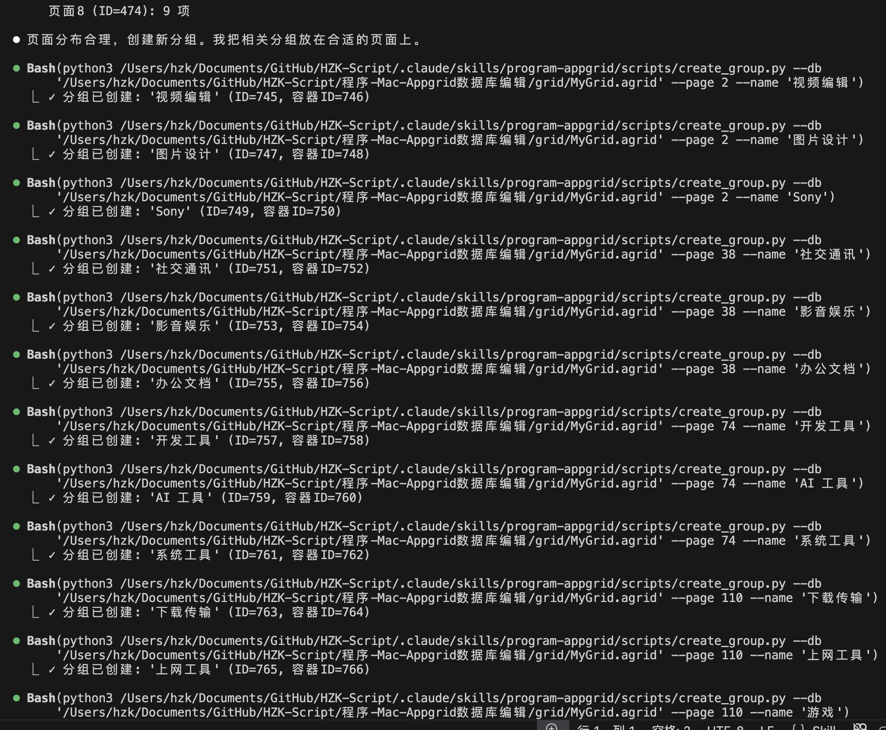
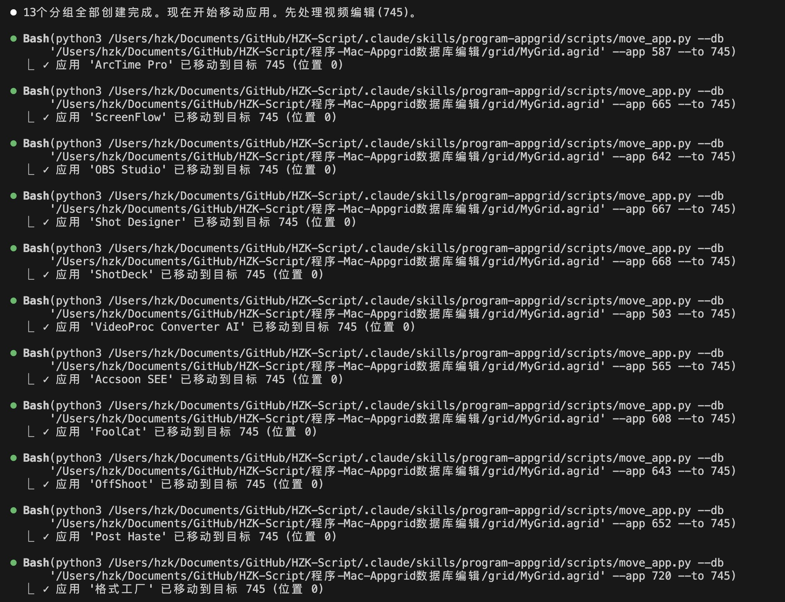
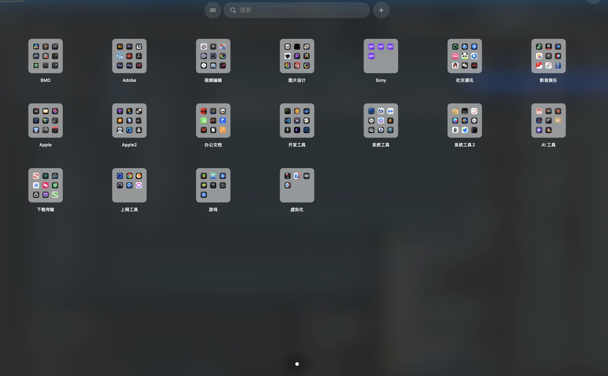

# mac-appgrid-skill


A Claude Code skill for managing AppGrid database on macOS.

**English** | [中文](README_CN.md) | [Changelog](CHANGELOG.md)

---

## Features



### Core Functions
- **List Structure** - Display tree view of pages, groups, and apps
- **Search Apps** - Find apps by name or bundle ID
- **Group Management** - Create, rename, delete, and move groups
- **Move Apps** - Move apps between pages and groups
- **Group Pagination** - Groups auto-paginate when exceeding 35 apps per page
- **Export Data** - Export app list to CSV or JSON

### Diagnostic Tools
- **Statistics Overview** - Show total apps, groups, and counts per group
- **Check Ungrouped** - List all apps not in any group
- **Integrity Check** - Detect orphan records, empty groups, missing bookmarks

---

## System Requirements

| Platform | Minimum Version |
|----------|-----------------|
| macOS | 10.15+ |
| Python | 3.8+ |
| Claude Code | Latest |

---

## Installation

### From Releases

Download the latest version from [Releases](https://github.com/Tonyhzk/mac-appgrid-skill/releases).

### Manual Installation

```bash
cd ~/.claude/skills/
git clone https://github.com/Tonyhzk/mac-appgrid-skill.git program-appgrid
```

---

## Quick Start

```bash
# List all apps in tree structure
python3 ~/.claude/skills/program-appgrid/scripts/list_tree.py --db ~/path/to/MyGrid.agrid

# Check ungrouped apps
python3 ~/.claude/skills/program-appgrid/scripts/check_ungrouped.py --db ~/path/to/MyGrid.agrid

# Create a new group
python3 ~/.claude/skills/program-appgrid/scripts/create_group.py --db ~/path/to/MyGrid.agrid --page 2 --name "Video Editing"
```

---

## Screenshots

### Before - Apps scattered across pages

| | |
|---|---|
|  |  |

### In Progress - Claude Code organizing apps

| | |
|---|---|
|  |  |

### After - All apps neatly grouped



---

## Configuration

No configuration required. Specify the `.agrid` database path with the `--db` parameter when running scripts.

---

## Project Structure

```
program-appgrid/
├── SKILL.md              # Skill definition
├── scripts/              # Python scripts
│   ├── core.py           # Shared database operations
│   ├── list_tree.py      # List tree structure
│   ├── search.py         # Search apps
│   ├── create_group.py   # Create group
│   ├── delete_group.py   # Delete group
│   ├── rename_group.py   # Rename group
│   ├── move_app.py       # Move app
│   ├── move_group.py     # Move group
│   ├── export.py         # Export data
│   ├── stats.py          # Statistics overview
│   ├── check_ungrouped.py # Check ungrouped apps
│   └── check_integrity.py # Integrity check
└── references/
    └── db-schema.md      # Database schema reference
```

---

## Acknowledgements

Built for [AppGrid](https://zekalogic.com/appgrid/) users who want to manage their app grid programmatically.

---

## License

[Apache License 2.0](LICENSE)

---

## Author

[Tonyhzk](https://github.com/Tonyhzk)